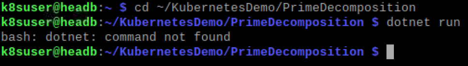

# How to use Docker to run the app

## Build and run an Docker image

Execute the following commands on the _Head_.

1. Clone the repository for the application
    ```bash
    $ git clone https://github.com/tschissler/KubernetesDemo.git
    ```
1. Try to run the PrimeDecomposition service
    ```bash
    $ cd KubernetesDemo/PrimeDecomposition
    $ dotnet run
    ```
    This results in an error message as the .NET SDK is not installed on the machine.

    
1. We could now install all the dependencies on the local computer to get the app compiling and running. But look, there is a `Dockerfile` in the current folder. Could we not just create a container and run compiling and execution inside the container? We do not have to know much about the needed environment, everything is defined in the `Dockerfile`. Just try it out first, we will have a look at the file a bit later.
    ```bash
    cd ~/KubernetesDemo
    docker build -f PrimeDecomposition/Dockerfile -t primedecompservice .
    ```
    Make sure you do not miss the dot in the end as it specifies the current folder as the context for the whole build operation. 
    The docker command can only access files within this context. The operation can take a bit if it runs for the first time as it downloads some 
    images from _dockerhub_, a public repository for docker images. No worries, next time it will be much faster.
    
    The result of this operation should look something like this:

    

    That last command builds a docker image which we tag `primedecompservice` with `-t` to refer to it later instead of having to fiddle with IDs.
    You can easily list all available images:
    ```bash
    $ docker images
    REPOSITORY                        TAG       IMAGE ID       CREATED              SIZE
    primedecompservice                latest    caf3d2255a9d   About a minute ago   174MB
    <none>                            <none>    00a7f1273284   About a minute ago   576MB
    mcr.microsoft.com/dotnet/sdk      5.0       e388c04f9eb3   46 hours ago         569MB
    mcr.microsoft.com/dotnet/aspnet   5.0       0d95d6c17320   46 hours ago         174MB
    ```
    Here you can see that we have some dotnet images provided by Microsoft. The image we just created is based on the last one.

1. You can now run a container using this image.
    ```bash
    docker run -it --rm -p 8080:80 primedecompservice
    ```

This will run our service within the container. We are exposing the port 80 which is used by our service within the container to the local port 8080.


You can now access the service in a browser on the head node: http://localhost:8080/?number=52

That was easy and each time the service need changes in the environment (components, frameworks, environmentvariables etc.) this can be 
considered in the Dockerfile and your can easily create a new container with all these requirements.

Let's have a look at the Dockerfile before we move on. 

```bash
code ~/KubernetesDemo/PrimeDecomposition/Dockerfile 
```

```dockerfile
FROM mcr.microsoft.com/dotnet/sdk:5.0 AS build
COPY Dtos/ /src/Dtos/
COPY PrimeDecomposition/ /src/PrimeDecomposition/
WORKDIR /src/PrimeDecomposition
RUN dotnet restore
RUN dotnet publish "PrimeDecomposition.csproj" -c Release -o /app

FROM mcr.microsoft.com/dotnet/aspnet:5.0
WORKDIR /app
COPY --from=build /app .
ENV ASPNETCORE_URLS="http://+:80"
EXPOSE 80
ENTRYPOINT [ "dotnet", "PrimeDecomposition.dll" ]
```

Lines 1-6 are describing the build process. In line 1 the image (which by default is pulled from dockerhub.io, 
a public repository for docker images) is defined and the container is referenced to as "build".
Line 2 and 3 are copying files from the context into the container. Then we change in the folder and 
run commands to build the service. Line 6 does a build and creates an output file (PrimeDecomposition.dll) that
will be executed during runtime. The files will be stored in the `/app` folder.

Lines 8-13 are describing the image that is created. Here we use a different image which is only including the dotnetcore 
runtime and not the full sdk. In line 10 we copy the files from our build container into the image. Line 11 sets an environment 
variable while line 12 defines the port to expose to the external world. Finally line 13 defines the command to be executed 
when the container is starting up.

## How to create and run multiple containers
OK, that was easy, but our application consists of 3 different services. Obviously we could do the same thing for each service, 
but wouldn't it be cool if we could easily control these containers together? Here comes docker-compose to our rescue.
Fortunately there is already a `docker-compos.yml` file in the root folder of the repository. Again, let's first try it and then look into it.

```bash
cd ~/KubernetesDemo
docker-compose up
```
This now creates images for each of the 3 services and then starts a container for each. You can access the result in a browser on the head again:
`http://localhost:4300`

Not bad, not bad at all. 

With Docker you have no longer worry about the right environment, setting ports, environment variables etc. This is now part of the source code repository. 
This is what we call "Infrastructure as code". No need to create backups of the environments you run your applications in. These can easily be recreated, even on a different hardware. You just have to backup your data.

So let's have a look at the `dockercompose.yml` because there is some nice magic to be discovered.

```yml
version: "3.7"

services:
  prime-decomposition:
    container_name: prime-decomposition
    image: "prime-decomposition"
    build:
      context: .
      dockerfile: ./PrimeDecomposition/Dockerfile
    environment:
      - ASPNETCORE_ENVIRONMENT=Production
    expose:
      - "80"
    networks:
      - k8sdemo

  number-generator:
    container_name: number-generator
    image: "number-generator"
    build:
      context: .
      dockerfile: ./NumberGenerator/Dockerfile
    environment:
      - ASPNETCORE_ENVIRONMENT=Production
      - PRIME_DECOMPOSITION_URL=http://prime-decomposition
    expose:
      - "80"
    networks:
      - k8sdemo

  prime-decomposition-ui:
    container_name: prime-decomposition-ui
    image: "prime-decomposition-ui"
    build:
      context: .
      dockerfile: ./PrimeDecompositionUi/Dockerfile
    environment:
      - ASPNETCORE_ENVIRONMENT=Production
      - NUMBER_GENERATOR_URL=http://number-generator
    expose:
      - "80"
    ports:
      - "4300:80"
    networks:
      - k8sdemo
        
networks:
  k8sdemo:
```

First we define the 3 services of our application (`prime-decomposition`, `number-generator` and `prime-decomposition-ui`).
For each service we define a name for the container and for the image (similar to the `-t` parameter). Then we use the 
Dockerfiles we have used before. In the section `environment` we define environment variables. We define the port the 
container exposes and the network it connects to. The network is defined at the bottom of the file. As all containers
connect to the same network, they are able to communicate with each other. To isolate the containers, different networks
can be used. 

Also have a look at the `*_URL`-parameters in the `environment` section of the `number-generator` and the `prime-decomposition-ui` services.
They use the name of another container in the URL. On the network we can use the container name for name resolution.
Another interesting detail is in the `prime-decomposition-ui` service where you find the parameter `ports`. Here we route the 
port 80 from inside the container to the external port 4300 or in other words, service from inside the container can now be 
accesses via port 4300. The other containers have not defined any ports which means they are only reachable from inside the 
network (in Docker), but not from the outside (the local host). That's really helpful from a security perspective.
