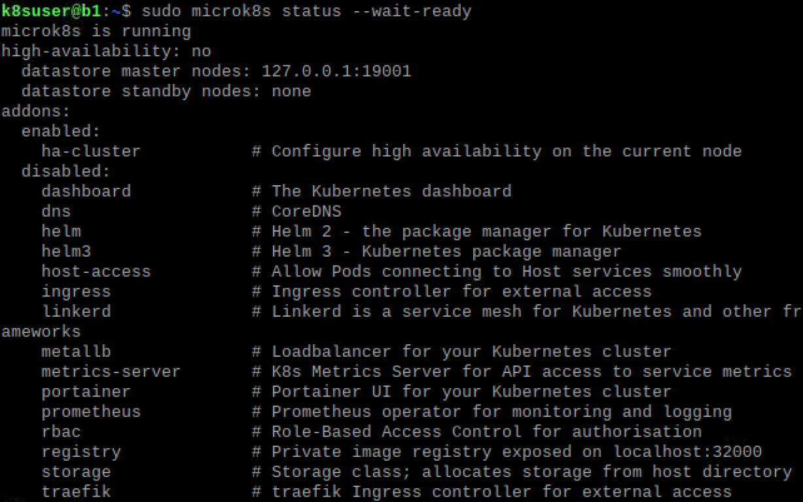
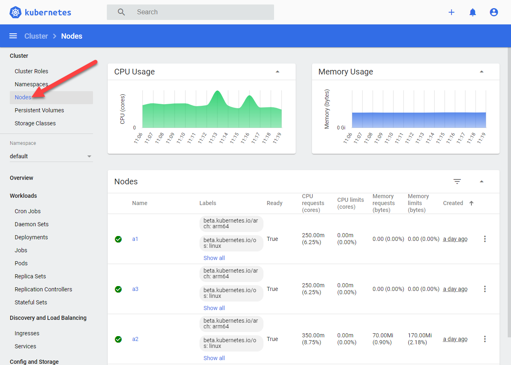

# Installing the Cluster
For the Kubernetes cluster we are going to use `microk8s` (https://microk8s.io/). This walkthrough was inspired by https://ubuntu.com/tutorials/how-to-kubernetes-cluster-on-raspberry-pi#1-overview.

Make sure that you ssh-ed into each of your cluster nodes and not running the following commands on your _Head_ node.

```bash
ssh k8suser@a1
```
Replace a1 with the name of the node you are going to install.

## Install `microk8s`
You just need to run a single command:
  ```bash
  sudo snap install microk8s --classic
  ```

You should run this command on all 3 nodes.

After the installation is finished, you can start the node with:
  ```bash
  sudo microk8s start
  ```

and check the status with:
  ```bash
  sudo microk8s status --wait-ready
  ```

This could take a while as it waits until the services have all started up. 
After a couple of minutes you should see the folloowing output.
If that is not the case try to run `sudo microk8s start` and then `sudo microk8s status --wait-ready` again.



You can authorize the user to run microk8s without using sudo all the time, just to make your live a bit easier :-)
You will have to log off and in again to make these changes apply.
```bash
sudo usermod -a -G microk8s $USER
sudo chown -f -R $USER ~/.kube
```

## Assign master and leafs
Our cluster consists of 3 nodes. This allows us later to spread load over multiple devices and to benefit from a high availability solution where the cluster can move services to another node when one becomes unavailable.
To do so, we have first to combine the 3 nodes into one cluster.
One of your nodes now becomes the master node, the others become leaf nodes. Pick one for master and run the following command:
  ```bash
  microk8s.add-node
  ```
This command will generate a connection string in the form of `<master_ip>:<port>/<token>` and will provide you with a 
command you can copy over to one leaf node to join the cluster. Be aware that you have to create a new token for each node.

You have to start microk8s again on each node after adding a node to the cluster.

You can list the registered nodes with
  ```bash
microk8s kubectl get nodes
```

## Enable microk8s plugins
We are going to use some additional plugins which we can easily enable on our cluster. 
Just run this command on one of your nodes, the configuration is then applyied to the whole cluster.
```bash
microk8s.enable dashboard dns metrics-server portainer registry
```

This will also enable a local registry on our cluster where we can store our docker images.
We have to register this registry on each of our cluster nodes.

```bash
sudo nano /var/snap/microk8s/current/args/containerd-template.toml
```
and add at the end of the file:
```
      [plugins."io.containerd.grpc.v1.cri".registry.mirrors."a1:32000"]
        endpoint = ["http://a1:32000"]
      [plugins."io.containerd.grpc.v1.cri".registry.mirrors."a2:32000"]
        endpoint = ["http://a2:32000"]
      [plugins."io.containerd.grpc.v1.cri".registry.mirrors."a3:32000"]
        endpoint = ["http://a3:32000"]
```
Replace `a1`, `a2` and `a3` with `b1`, `b2` and `b3`if you are creating ClusterB.
Restart the cluster for the changes to take effect:

```bash
microk8s.stop
microk8s.start
```
Again, you have to do this on every node.

More information about the private registry:
* https://microk8s.io/docs/registry-built-in
* https://microk8s.io/docs/registry-private


## Start the K8s dashboard
The [microk8s dashboard addon](https://microk8s.io/docs/addon-dashboard) is a website for monitoring and controlling the K8s cluster. After enabling the addon it already runs in a container in the cluster and just needs to be assigend to a port on a cluster node to reach it:
```bash
microk8s dashboard-proxy
```
Now you can open the webpage `https://<node name>:10443` with the `<node name>` of the node where you started the port forwarding. 
After ignoring the certificate warning, you have to authorize. The easiest way is to use the token that was printed with the previous command.



## Deploy application to the cluster
Now you are ready to deploy and execute our application to the cluster. Follow [5_DeployApplicationToCluster](5_DeployApplicationToCluster.md)
