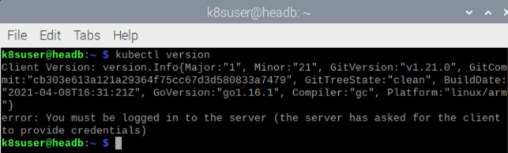
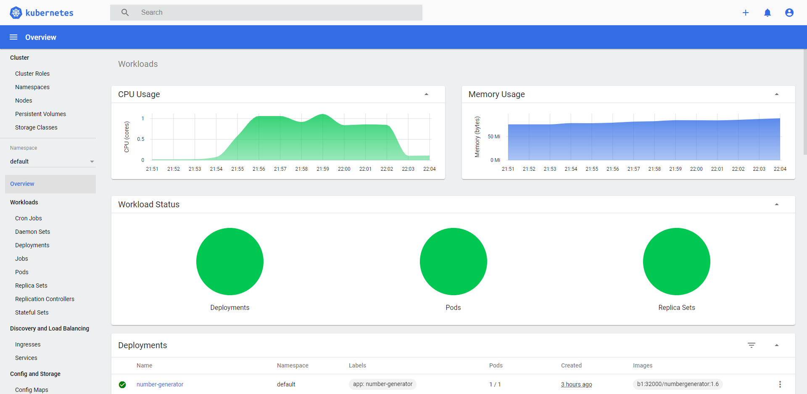
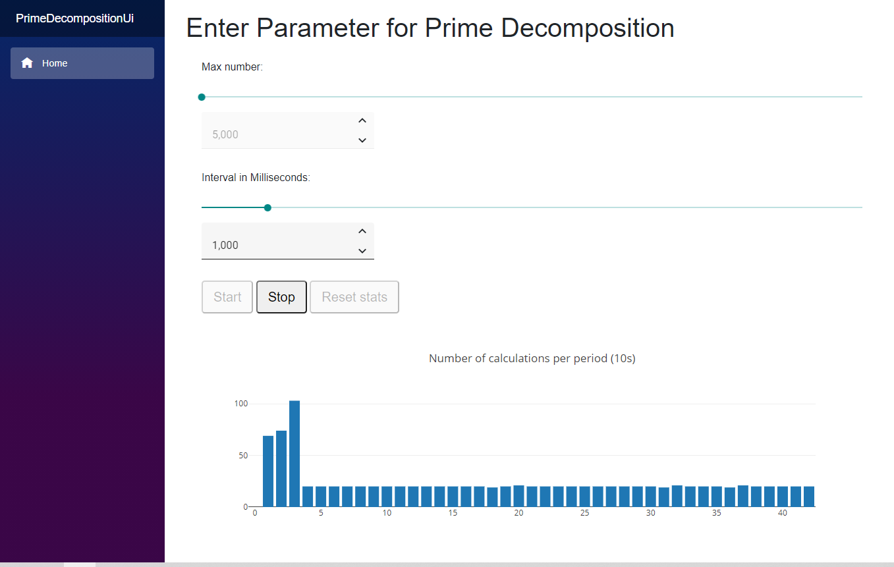
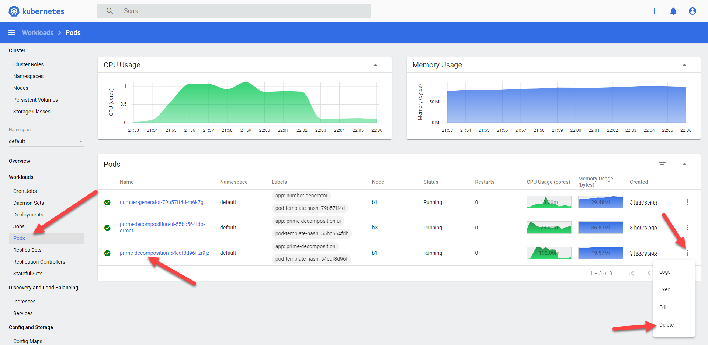
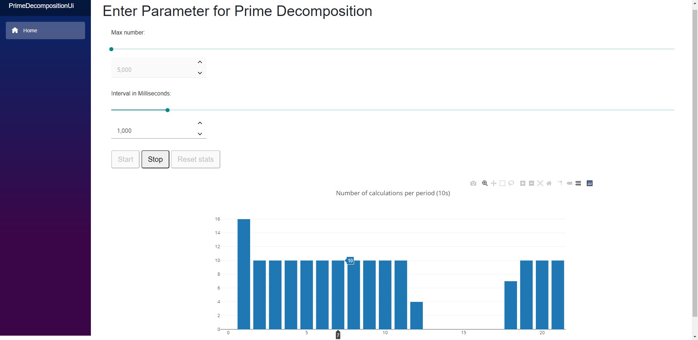
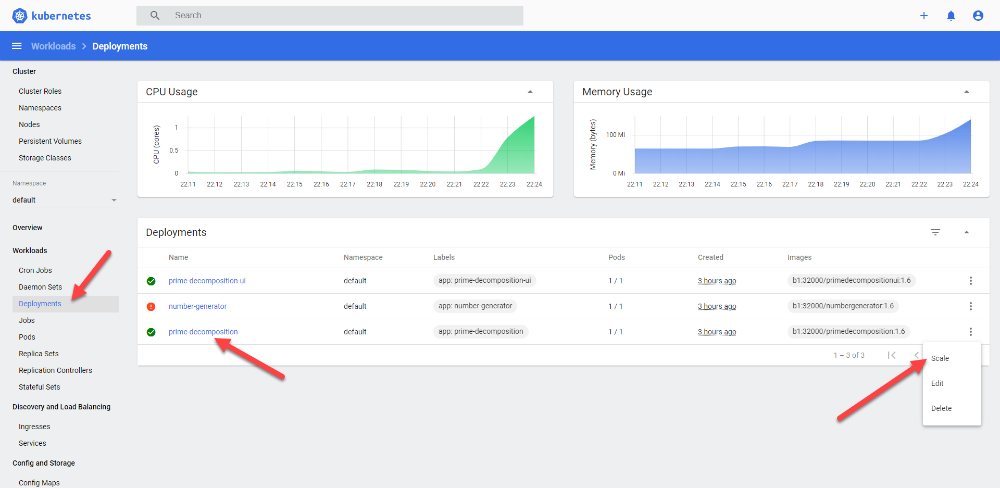

# Deploying the application into the cluster

To deploy our application into the cluster, we have to use a different command `kubectl`. 
First make suer that kubectl is installed on your head by running
```bash 
kubectl version
```



## Configure kubectl to connect to the cluster
Next, we have to configure user, cluster and context.
Notes:
* Replace `<master>` with the name of the K8s master node.
* The `<token>` can be fetched on a K8s node with the command `microk8s.kubectl -n kube-system describe secret $(microk8s kubectl -n kube-system get secret | grep default-token | cut -d " " -f1)`
```bash
kubectl config set-credentials user/picluster --token=<token>
kubectl config set-cluster cluster/picluster --insecure-skip-tls-verify=true --server=https://<master_ip>:16443
kubectl config set-context default/picluster/user --user=user/picluster --namespace=default --cluster=cluster/picluster
kubectl config use-context default/picluster/user
```

Let's list the nodes inb our cluster to check the configuration.
```bash
kubectl get nodes
```


## Deploy applications

First we have to build the container images and deploy them to the cluster repository. 
There is a script available that helps with that. 
You can just look into the `build-and-push-images-on-head.sh` and update the `VERSION` to a new, higher version 
and provide the name of your master node in `CLUSTERNAME`

Then execute the script. Probybly you have to apply access rights before you can execute it.

```bash
kubectl get nodes
``` 

We have already prepared some configuration files which we wil examine closer a bit later. Again just execute them to see what's happening.

```bash
cd ~/KubernetesDemo/.k8s
kubectl apply -f .
```

This will start 3 pods (container instances) to run the whole application. If you now connect to the dashboard, you can examine the cluster.
Open `https://<node>:10443` where `<node>` is the node you started the proxy before (make sure it is still running if you having connection issues).



You can now open the application via `http://<anynode>:30000` where `<anynode>` is any of the nodes in your cluster. 
After clicking "Start" you should see some results in the chart after a couple of seconds. The chart shows the number of culculations
that could be finished within a 10 sec timeframe. As the default interval is set to 1000ms there should be 10.



So what makes now the magic of a Kubernetes cluster that get everybody so excited? Let's explore some of them.

What would happen if one of your container crashes? Let's find out while we simulate this situation by deleting a pod while the calculation is running. 



You will see that the cluster is starting a new pod after a couple of seconds. This is because we have defined a deployment with one instance for each image of our app.
If the cluster recognizes a deviation from this definition, it corrects the situation by starting a new instance.
In the frontend we see a short gap of calculations but then the system recovers automatically.



That's nice, but there must be more. Let's increase the load a bit. Stop the calculation in the UI and set parameters to *Max number = 30.000.000* and *Interval = 1.000* in the UI.
Then start the calculation again. You should see that about 10 calculations are executed in each period. Now change the interval to 10. 
We would expect to get 100 times more calculations to be executed which means 1.000 per period. But that is not true. 
We get more but still much less than 1.000 and over time the number even decreases, in some periods itr is even 0. 
That is because our Prime-Decomposition-Service is now in overload, it gets much more requests than it can handle.
We should probably scale it to get  back to smooth operation.

In the Deployments click on *Scale* for the *prime-decomposition* service and set the number of desired replicas to 9.


If you look at the *Pods* section in the dashboard now, you can see that it starts 8 more pods. 
It should not take long before all pods are green again and the situation stabalizes again. You see now relatively constant calculation results
at a pace of around 750 per 10s without any gaps. That means we can serve all the requests in a timely manner.
You might have recognized that the pods are running on different nodes to spread the load over various hardware instances.

We could to this in an even more sophisticated way by autoscaling. The idea of an autoscaler is that it detects the high load and triggers scaling automatically.
If the load decreases, it removes pods that are not needed for the current load. Let's try this. 
First change the interval in the UI back to *1.000*. Then scale down the deployment to 1 desired replica set. 
You can see that all pods for the *prime-decomposition* service are removed except one.

Now open the `prime-decomposition.yml`

```bash
code ~/KubernetesDemo/.k8s/prime-decomposition.yml
```

At the end of the file add this:
```yml
---
apiVersion: autoscaling/v1
kind: HorizontalPodAutoscaler
metadata:
  name: prime-decomposition
spec:
  maxReplicas: 12
  minReplicas: 1
  scaleTargetRef:
    apiVersion: apps/v1
    kind: Deployment
    name: prime-decomposition
  targetCPUUtilizationPercentage: 50
```

Then apply the configuration changes

```bash
cd ~/KubernetesDemo/.k8s
kubectl apply -f .
```

You can see from the output, that only the configuration changes are executed and we now have an autoscaler. 
So let's put some load on our system by changin the interval back to 10ms.

The load increases and you might see the pod in the dashboard shown with a read icon which indicates that the pod
is even no longer able to respond to the health-check executed by the cluster. 
A couple of moments later the cluster increases the number of pods to 4 and in the UI the situation is already more stable (no gaps in the chart).
But as the load still is higher than the 50% CPU utilization we have defined for our autoscaler and it did not reach the limits of 12 replicas, 
there are more pods created. 

Now let's reduce the load again by setting the interval to 1.000 again. 
It takes a couple of minutes but then the autoscaler will reduce the number of pods as they are not needed to handle the current load.

