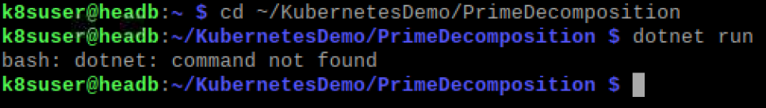
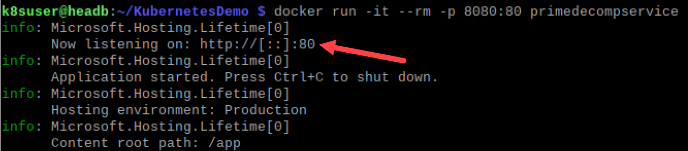

# How to use Docker to run the app

1. Clone the repository for the application
```bash
git clone https://github.com/tschissler/KubernetesDemo.git
```

2. Try to run the PrimeDecomposition service
```bash
cd ~/KubernetesDemo/PrimeDecomposition
dotnet run
```

This results in an error message as the .NET SDK is not installed on the machine.


3. We could now install all the dependencies on the local computer to get the app compiling and running. 
But look, there is a Dockerfile in the current folder. Could we not just create a container and run the build and execution inside the container?
We do not have to know much about the needed environment, everything is defined in the Dockerfile. Just try it out first, we will have a look at the file a bit later.

```bash
cd ~/KubernetesDemo
docker build . -f PrimeDecomposition/Dockerfile 
```

Make sure you do not miss the dot in the middle of this command as it specifies the current folder as the context for the whole build operation. 
The docker command can only access files within this context.

This command builds a docker image which we tag 'primedecompservice' to refer to it later instead of haqving to fiddle with IDs.
You can easily list all available images:
```bash
k8suser@headb:~/KubernetesDemo $ docker images
REPOSITORY                        TAG       IMAGE ID       CREATED              SIZE
primedecompservice                latest    caf3d2255a9d   About a minute ago   174MB
<none>                            <none>    00a7f1273284   About a minute ago   576MB
mcr.microsoft.com/dotnet/sdk      5.0       e388c04f9eb3   46 hours ago         569MB
mcr.microsoft.com/dotnet/aspnet   5.0       0d95d6c17320   46 hours ago         174MB
k8suser@headb:~/KubernetesDemo $ 
```

You can now run a container using this image.

```bash
docker run -it --rm -p 8080:80 primedecompservice
```

This will run our service within the container. We are exposing the port 80 which is used by our service within the container to the local port 8080.


You can now access the service in your browser: http://localhost:8080/?number=52

That was easy and each time the service need changes in the environment (components, frameworks, environmentvariables etc.) this can be 
considered in the Dockerfile and your can easily create a new container with all these requirements.

Let's have a look at the Dockerfile before we move on. 

```bash
code ~/KubernetesDemo/PrimeDecomposition/Dockerfile 
```

```dockerfile
FROM mcr.microsoft.com/dotnet/sdk:5.0 AS build
COPY Dtos/ /src/Dtos/
COPY PrimeDecomposition/ /src/PrimeDecomposition/
WORKDIR /src/PrimeDecomposition
RUN dotnet restore
RUN dotnet publish "PrimeDecomposition.csproj" -c Release -o /app

FROM mcr.microsoft.com/dotnet/aspnet:5.0
WORKDIR /app
COPY --from=build /app .
ENV ASPNETCORE_URLS="http://+:80"
EXPOSE 80
ENTRYPOINT [ "dotnet", "PrimeDecomposition.dll" ]
```

Lines 1-6 are describing the build process. In line 1 the image (which by default is pulled from dockerhub.io, 
a public repository for docker images) is defined and the container is referenced to as "build".
Line 2 and 3 are copying files from the context into the container. Then we change in the folder and 
run commands to build the service. Line 6 does a build and creates an output file (PrimeDecomposition.dll) that
will be executed during runtime. The files will be stored in the /app folder.

Lines 8-13 are describing the image that is created. Here we use a different image which is only including the dotnetcore 
runtime and not the full sdk. In line 10 we copy the files from our build container into the image. Line 11 sets an environment 
variable while line 12 defines the port to expose to the external world. Finally line 13 defines the command to be executed 
when the container is starting up.